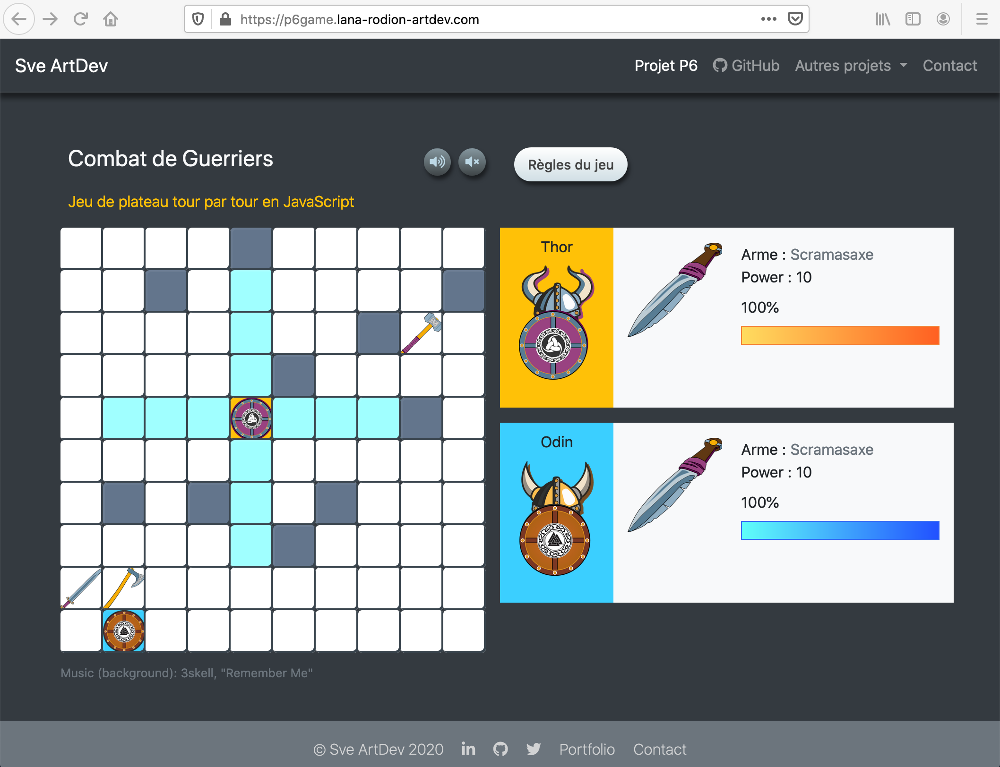

# p6game_new 

***Turn-based JS board game on-line*** <https://p6game.lana-rodion-artdev.com/>

## Description

Project 6 - Create a turn-based JS board game.
Front-end Developer Training / Openclassrooms.
This project consists to create an online game in JavaScript where 2 players take turns to compete.
As in Highlander, there can only be one left!

## Goal setting

*   Create turn-based JS board game on-line
*   Develop an object-oriented JavaScript application

## Specification

### Step 1 - Game Board and elements generation

*   Start by randomly generating the game map
*   Each box can be either: empty or inaccessible (grayed background)
*   On the map, a limited number of weapons (4 maximum) will be randomly placed
*   Create at least 4 types of weapons in the game, with different damage
*   Each weapon has a name and an associated visual
*   The default players weapon must deal 10 points of damage
*   The placement of the two players on the map is random when the game is starting
*   Players cannot touch each other (they cannot be side by side) when the game is loading

### Step 2 - Players movements and Weapons changes

*   On each turn, a player can move one to three spaces (horizontally or vertically) before complete his turn
*   He cannot cross an obstacle
*   If a player cross over a space containing a weapon, he leaves his current weapon in place and replaces it with the new one

### Step 3 - The fight

*   If the players cross on adjacent squares (horizontally or vertically), a fight begins

*   During a fight, the game works as follows:
    *   Each player attacks in turn
    *   Damage inflicted depends on the weapon which the player has
    *   Player can choose to attack or defend against the next hit
    *   When the player defends, he takes 50% less damage than normal
    *   As soon as a player's life points (initially 100) drop to 0, the player loses
    *   A message appears that the game is over

### Delivery

Project HTML / CSS / JavaScript code

### Skills assessed

*   Develop an object-oriented JavaScript application
*   Implement the jQuery library in a web application
*   Design a reusable JavaScript application architecture

***Note***: The project is realized independently for the Front-end Developer Training

### Tools

*   WebStorm
*   Brackets Editor
*   Browser console window
*   GitKraken
*   Codacy
*   Code Climate
*   Adobe CC Photoshop
*   Adobe CC Illustrator

## User interface

***Turn-based JS board game UI on-line*** <https://p6game.lana-rodion-artdev.com/>

## Sources

*   <https://openclassrooms.com/fr/courses/5543061-ecrivez-du-javascript-pour-le-web>
*   <https://openclassrooms.com/fr/courses/3306901-creez-des-pages-web-interactives-avec-javascript>
*   <https://openclassrooms.com/fr/courses/1631636-simplifiez-vos-developpements-javascript-avec-jquery>
*   <https://www.freecodecamp.org/learn/javascript-algorithms-and-data-structures/es6/>

